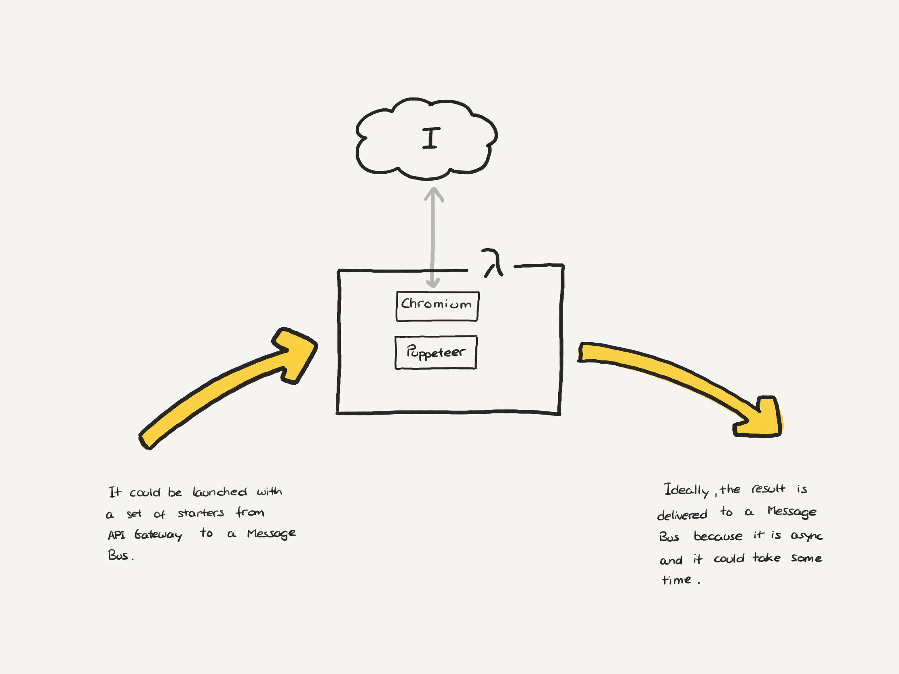

This project is a spike to understand the complexity of executing a Chromium mamanged with Puppeter in AWS Lambda.

The main goal is to validate that we can launch Puppeteer/Chromium, doing some scraping, and returning the results in an asynchronous way.

## References

* [NPM package to automatic download Chromium](https://github.com/alixaxel/chrome-aws-lambda)
* [Puppeteer and Lambda Container Functions](https://medium.com/@kostakirov123/puppeteer-and-lambda-container-functions-a-match-made-in-heaven-2b13a14ec5a8), and [repo](https://github.com/kosta1221/puppeteer-in-lambda-container-demo)
* [Building a layer with Puppeteer](https://github.com/celeron1ghz/lambda-layer-puppeteer)
